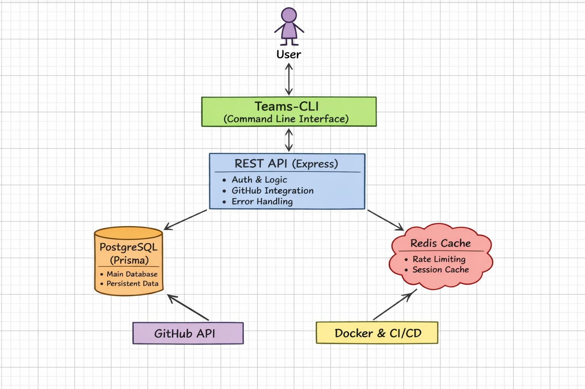
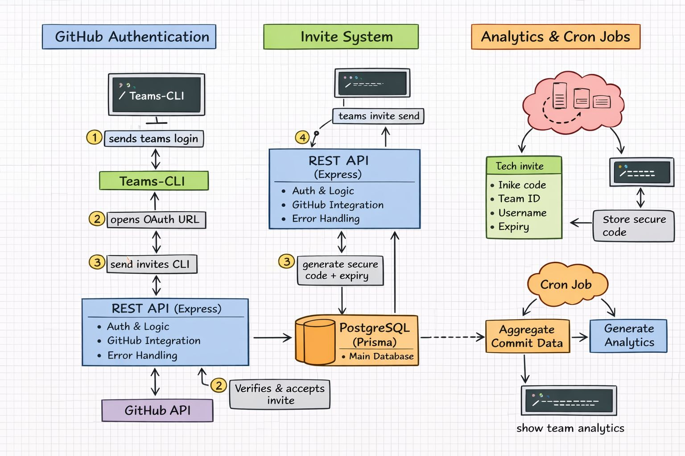
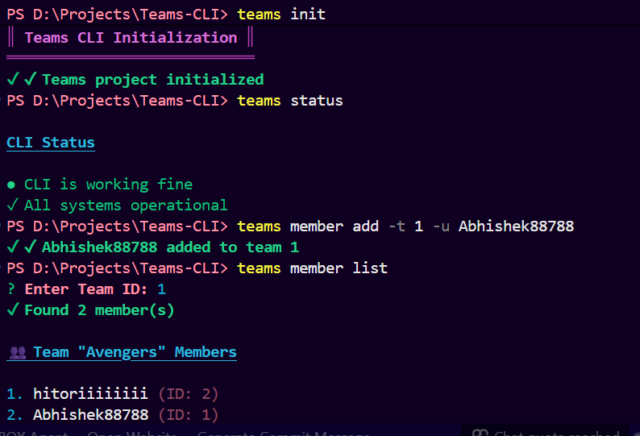

# Teams CLI

> A comprehensive, production-ready CLI tool and REST API for managing GitHub teams, repositories, members, and analytics. Built with **TypeScript**, **Express**, **Drizzle ORM**, and **Redis**.

[](https://www.npmjs.com/package/@prarthana25/teams-cli)
[](https://nodejs.org/)
[](https://opensource.org/licenses/MIT)

**Author**: [hitoriiiiiiii](https://github.com/hitoriiiiiiii) | **GitHub**: [Teams-Cli2](https://github.com/hitoriiiiiiii/Teams-Cli2)

---

## Features

### Core Capabilities

- **Team Management** - Create, view, update, and manage teams
- **Member Management** - Add, remove, and list team members with role management
- **Invite System** - Send secure invites with unique codes and auto-expiration
- **Repository Management** - Add GitHub repositories, track metadata, analyze code
- **Commit Tracking** - Monitor commits, analyze contributions, and track activity
- **GitHub OAuth** - Secure authentication with GitHub integration
- **Rate Limiting** - Redis-backed API rate limiting for protection against abuse
- **Analytics** - Real-time team activity tracking and detailed statistics
- **CLI Interface** - Interactive command-line interface with intuitive commands
- **REST API** - Full-featured REST API for programmatic access
- **SQLite Database** - Lightweight, file-based database with Drizzle ORM for type-safe queries

## Installation

### Global Installation (Recommended for CLI Use)

```
bash
npm install -g @prarthana25/teams-cli
teams login
```

### Local Installation (For Project Dependency)

```
bash
npm install @prarthana25/teams-cli
```

### Using npx (No Installation Required)

```
bash
npx @prarthana25/teams-cli login
npx @prarthana25/teams-cli team list
```

## Quick Start

### 1. Login with GitHub

```
bash
teams login
```

### 2. Create and Manage Teams

```
bash
# Create a new team
teams team create "MyAwesomeTeam"

# List your teams
teams team list

# Get team details
teams team get 1
```

### 3. Manage Team Members

```
bash
# Add a member to a team
teams member add --team-id 1 --username octocat

# List team members
teams member list --team-id 1

# Remove a member
teams member remove --team-id 1 --user-id 5
```

### 4. Invite System

```
bash
# Send an invite to a new user
teams invite send --team-id 1 --username newuser

# Accept an invite using code
teams invite accept --code ABC12345XYZ

# List pending invites
teams invite list --team-id 1
```

### 5. Repository Management

```
bash
# Add a GitHub repository to a team
teams repo add --team-id 1 --url https://github.com/user/repo

# List repositories
teams repo list --team-id 1
```

### 6. View Analytics

```
bash
# Get team activity summary
teams analytics summary --team-id 1

# View detailed analytics
teams analytics details --team-id 1
```

---

## Complete Command Reference

### Authentication

```
bash
teams login              # Login to Teams CLI with GitHub OAuth
teams logout             # Logout from Teams CLI
teams whoami             # Show current logged-in user
```

### User Operations

```
bash
teams user get [options] # Get another user's details

Options:
  -i, --id <id>          # User ID
  -u, --username <username> # GitHub username
```

### Team Operations

```
bash
teams team create [name] # Create a new team
teams team list          # List all teams
teams team get -i <id>   # Get team details
teams team delete -i <id> # Delete a team
teams team join -i <id>  # Join a team
teams team leave -i <id> # Leave a team
```

### Member Operations

```
bash
teams member add -t <id> -u <username>    # Add member to team
teams member remove -t <id> -u <username> # Remove member from team
teams member list -t <id>                 # List team members
```

### Repository Operations

```
bash
teams repo add <teamName> <repoName>      # Add a repo to a team
teams repo list <teamName>                # List all repos of a team
teams repo remove <teamName> <repoName>   # Remove a repo from a team
```

### Invite Operations

```
bash
teams invite send -t <id> -u <username>   # Send team invite
teams invite accept -c <code>             # Accept an invite
teams invite reject -c <code>             # Reject an invite
teams invite list -t <id>                 # List pending invites for a team
```

### Commits Operations

```
bash
teams commits list <owner> <repo> [options] # List commits for a repository
teams commits get <owner> <repo> <sha>      # Get details of a specific commit

```

### Analytics Operations

```
bash
teams analytics activity -t <id>          # Show member activity (7/14/30 days)
teams analytics leaderboard -t <id>       # Show top contributors
teams analytics member -t <id> -u <username> # Show analytics for a member
teams analytics summary -t <id>           # Show team analytics summary
```

### Configuration

```
bash
teams config set -k <key> -v <value>      # Set config value
teams config get -k <key>                 # Get config value
teams config list                         # List all config
```

### Utility

```
bash
teams init               # Initialize Teams CLI project
teams status             # Check CLI status
teams help               # Show this help menu
```

### System

```
bash
teams help              # Show help information
teams version           # Display version
```

---

## Project Structure

```
Teams-CLI/
├── src/
│   ├── api/                    # REST API server
│   │   ├── server.ts           # Express server setup
│   │   ├── redis.ts            # Redis client configuration
│   │   └── rateLimiter.ts      # Rate limiting middleware
│   │
│   ├── cli/                    # CLI command handlers
│   │   ├── command.ts          # Command registration & routing
│   │   ├── auth.ts             # Authentication commands
│   │   ├── team.ts             # Team commands
│   │   ├── github.ts           # GitHub integration
│   │   └── help.ts             # Help documentation
│   │
│   ├── controllers/            # API request handlers
│   │   ├── team.controller.ts
│   │   ├── user.controller.ts
│   │   ├── repo.controller.ts
│   │   ├── commit.controller.ts
│   │   ├── invite.controller.ts
│   │   └── analytics.controller.ts
│   │
│   ├── services/               # Business logic layer
│   │   ├── github.services.ts  # GitHub API interactions
│   │   ├── npm.services.ts     # NPM operations
│   │   └── analytics.services.ts
│   │
│   ├── utils/                  # Utility functions
│   │   ├── logger.ts           # Logging utility
│   │   ├── spinner.ts          # CLI spinner
│   │   ├── inquirer.ts         # Interactive prompts
│   │   └── currentUser.ts
│   │
│   ├── config/                 # Configuration
│   │   └── auth.config.ts      # Auth configuration
│   │
│   ├── core/                   # Core functionality
│   │   └── cron.analytics.ts   # Scheduled analytics
│   │
│   ├── db/                     # Database layer
│   │   ├── index.ts            # Drizzle ORM initialization
│   │   ├── schema.ts           # Database schema definitions
│   │   ├── queries.ts          # Prepared queries
│   │   └── repositories/       # Data access layer
│   │
│   ├── test/                   # Test files
│   │   ├── teams.test.ts
│   │   ├── user.test.ts
│   │   ├── repo.test.ts
│   │   ├── commit.test.ts
│   │   └── invite.test.ts
│   │
│   ├── index.ts                # CLI entry point
│   └── api.ts                  # API entry point
│
├── drizzle/                    # Database migrations
│   └── migrations/
│
├── scripts/                    # Build & utility scripts
│   └── pre-publish-check.ts
│
├── docker-compose.yml          # Docker services configuration
├── Dockerfile                  # Docker image
├── jest.config.ts              # Jest testing configuration
├── tsconfig.json               # TypeScript configuration
├── package.json                # Dependencies
└── README.md                   # This file
```

---

## Architecture Diagram

### System Architecture





### Output



---

## Getting Started

### Prerequisites

- **Node.js** `18.0.0` or higher
- **npm** `9.0.0` or higher
- **SQLite** (included - no separate installation needed)
- **GitHub Account** (for OAuth)
- **Docker & Docker Compose** (optional, for containerized deployment)

### Installation Steps

#### Step 1: Clone Repository

```
bash
git clone https://github.com/hitoriiiiiiii/Teams-Cli.git
git clone https://github.com/hitoriiiiiiii/Teams-Cli2.git
cd Teams-Cli2
```

#### Step 2: Install Dependencies

```
bash
npm install
```

#### Step 3: Configure Environment Variables

Create a `.env` file in the root directory:

```
env
# Database Configuration (SQLite - auto-created)
DATABASE_URL="file:./.teams-cli/teams.db"

# GitHub OAuth
GITHUB_CLIENT_ID="your-github-oauth-client-id"
GITHUB_CLIENT_SECRET="your-github-oauth-client-secret"
GITHUB_TOKEN="your-github-personal-access-token"

# API Configuration
PORT=3000
NODE_ENV=development
```

**How to Get GitHub OAuth Credentials:**

1. Go to GitHub Settings - Developer settings - OAuth Apps
2. Create a new OAuth application
3. Set Authorization callback URL to `http://localhost:3000/auth/github/callback`
4. Copy the Client ID and Client Secret to your `.env`

#### Step 4: Set Up Database

```
bash
# Database is automatically initialized on first run
# SQLite database will be created at ~/.teams-cli/teams.db

# (Optional) Seed test data
ts-node setup-test-user.ts
```

#### Step 5: Start the Application

**For CLI Development:**

```
bash
npm run dev
```

**For REST API:**

```
bash
npm run api
```

**For Production:**

```
bash
npm run build
npm start
```

---

## REST API

### Server Setup

Start the API server:

```
bash
npm run api
```

The server will be available at `http://localhost:3000`

### API Endpoints Overview

#### Health & Status

```
GET  /health              - Check API health
```

#### Teams

```
GET    /api/teams                    - List all teams
POST   /api/teams                    - Create new team
GET    /api/teams/:id                - Get team details
PUT    /api/teams/:id                - Update team
DELETE /api/teams/:id                - Delete team
GET    /api/teams/:id/members        - List team members
GET    /api/teams/:id/repos          - List team repositories
GET    /api/teams/:id/analytics      - Get team analytics
```

#### Users

```
GET    /api/users                    - List all users
GET    /api/users/:id                - Get user details
GET    /api/users/:id/teams          - Get user's teams
```

#### Repositories

```
GET    /api/repos                    - List all repositories
POST   /api/repos                    - Add repository
GET    /api/repos/:id                - Get repository details
DELETE /api/repos/:id                - Delete repository
GET    /api/repos/:id/commits        - Get repository commits
```

#### Commits

```
GET    /api/commits                  - List all commits
GET    /api/commits/:id              - Get commit details
GET    /api/repos/:id/commits        - List commits for a repository
```

#### Invites

```
GET    /api/invites                  - List all invites
POST   /api/invites                  - Create invite
POST   /api/invites/:code/accept     - Accept invite
DELETE /api/invites/:id              - Cancel invite
```

#### Analytics

```
GET    /api/analytics/summary        - Overall statistics
GET    /api/analytics/teams/:id      - Team analytics
GET    /api/analytics/repos/:id      - Repository analytics
```

### Authentication

All API requests (except health check and OAuth) require a Bearer token:

```
bash
curl -H "Authorization: Bearer YOUR_ACCESS_TOKEN" \
     http://localhost:3000/api/teams
```

### Example API Requests

**Create a Team:**

```
bash
curl -X POST http://localhost:3000/api/teams \
  -H "Authorization: Bearer YOUR_TOKEN" \
  -H "Content-Type: application/json" \
  -d '{
    "name": "Frontend Team",
    "description": "Our awesome frontend team"
  }'
```

**Add Repository to Team:**

```
bash
curl -X POST http://localhost:3000/api/repos \
  -H "Authorization: Bearer YOUR_TOKEN" \
  -H "Content-Type: application/json" \
  -d '{
    "teamId": 1,
    "url": "https://github.com/user/repo-name"
  }'
```

## Security & Rate Limiting

### Rate Limiting

The API implements comprehensive rate limiting powered by Redis:

| Endpoint Category        | Limit | Window     |
| ------------------------ | ----- | ---------- |
| **General Requests**     | 100   | 1 minute   |
| **Authentication**       | 10    | 15 minutes |
| **Sensitive Operations** | 5     | 1 minute   |
| **Public Endpoints**     | 200   | 1 hour     |

See [API_RATE_LIMITING.md](./API_RATE_LIMITING.md) for advanced configuration.

### Security Features

- **GitHub OAuth 2.0** - Secure token-based authentication  
- **CORS Protection** - Configured cross-origin access  
- **Input Validation** - Comprehensive parameter validation  
- **Token Encryption** - Secure token storage in database  
- **Rate Limiting** - Prevent brute force and DDoS attacks

---

## Testing

### Run All Tests

```
bash
npm test
```

### Run Tests with Coverage

```
bash
npm test -- --coverage
```

### Run Specific Test File

```
bash
npm test -- teams.test.ts
```

### Watch Mode (for development)

```
bash
npm test -- --watch
```

### Test Coverage Report

```
bash
# Generate coverage report
npm test -- --coverage

# View HTML report
open coverage/lcov-report/index.html
```

---

## Docker Deployment

### Quick Start with Docker Compose

Start all services (API, PostgreSQL, Redis) with one command:

```
bash
docker-compose up -d
```

This will automatically:
- Pull required images  
- Create and start all containers  
- Run database healthchecks  
- Configure networking between services

**Services Running:**
| Service | Container Name | Port | Status |
|---------|---|---|---|
| API | `teams_cli_app` | `3000` | Running |
| PostgreSQL | `teams_cli_db` | `5432` | Healthy |
| Redis | `teams_cli_redis` | `6379` | Healthy |

### Check Status

```
bash
# View all running containers
docker-compose ps

# Check container health
docker-compose ps --format "table {{.Service}}\t{{.Status}}"
```

### View Logs

```
bash
# View all logs in real-time
docker-compose logs -f service logs
docker-compose logs -f

# View specific app       # API application
docker-compose logs -f db        # PostgreSQL database
docker-compose logs -f redis     # Redis cache
```

### Stop Services

```
bash
# Stop all containers (keeps volumes)
docker-compose down

# Stop and remove all data (clean slate)
docker-compose down -v
```

### Docker Hub Images

Pre-built images available on Docker Hub:

```
bash
# Pull specific version
docker pull prarthana25/teams-cli:1.0.5

# Alternative image (myapp:v2)
docker pull prarthana25/myapp:v2

# Pull latest version
docker pull prarthana25/teams-cli:latest

# Run directly from Docker Hub
docker run -p 3000:3000 prarthana25/teams-cli:latest
```

### Build Custom Docker Image

Build your own image locally:

```
bash
# Build with version tag
docker build -t teams-cli:1.0.5 .

# Build with latest tag
docker build -t teams-cli:latest .

# Run the built image
docker run -p 3000:3000 teams-cli:latest
```

### Environment Configuration

Docker Compose automatically configures:

```
env
# Database (SQLite - volume-persisted)
DATABASE_URL=file:/app/.teams-cli/teams.db

# API
API_PORT=3000
NODE_ENV=production
```

To override, create a `.env.docker` file and run:

```
bash
docker-compose --env-file .env.docker up -d
```

### Access Services

Once containers are running:

```
bash
# API Health Check
curl http://localhost:3000/health

# Run CLI commands in container
docker-compose exec app teams --help
```

### Troubleshooting Docker

**Container won't start:**

```
bash
# Check logs
docker-compose logs app

# Verify dependencies are healthy
docker-compose ps
```

**Port already in use:**

```
bash
# Stop existing containers
docker-compose down

# Or use different port mapping
docker-compose -f docker-compose.yml up -d -p 3001:3000
```

**Database issues:**

```
bash
# Database is automatically initialized on first run
# Check database file location
ls -la ~/.teams-cli/teams.db
```

**Force rebuild (clear cache):**

```
bash
docker-compose build --no-cache
docker-compose up -d
```

---

## Configuration Reference

### Environment Variables

| Variable               | Description                      | Required | Default       |
| ---------------------- | -------------------------------- | -------- | ------------- |
| `DATABASE_URL`         | SQLite database path             | No    | `~/.teams-cli/teams.db` |
| `GITHUB_CLIENT_ID`     | OAuth client ID                  | Yes   | -             |
| `GITHUB_CLIENT_SECRET` | OAuth client secret              | Yes   | -             |
| `GITHUB_TOKEN`         | GitHub personal access token     | Yes   | -             |
| `NODE_ENV`             | Runtime environment              | No    | `development` |
| `PORT`                 | API server port                  | No    | `3000`        |
| `LOG_LEVEL`            | Logging level                    | No    | `info`        |

## Development Guide

### Project Scripts

```
bash
# Development
npm run dev              # Run CLI in development
npm run api              # Run API server
npm run build            # Compile TypeScript
npm start                # Run compiled application

# Testing
npm test                 # Run all tests
npm test -- --watch     # Watch mode
npm test -- --coverage  # Coverage report

# Code Quality
npm run lint             # Run ESLint
npm run format           # Format with Prettier

# Publishing
npm run pub              # Publish to NPM (public)
npm run pub:beta         # Publish beta version
npm run version:patch    # Bump patch version
npm run version:minor    # Bump minor version
npm run version:major    # Bump major version
```

### Database Management

```
bash
# Generate Drizzle ORM migrations
npm run migrate:generate

# Apply pending migrations
npm run migrate:push

# View database schema
# Database file is located at ~/.teams-cli/teams.db
```

### Adding a New Feature

1. Create feature branch: `git checkout -b feature/my-feature`
2. Update database schema in `src/db/schema.ts` if needed
3. Generate migration: `npm run migrate:generate`
4. Implement feature in `src/`
5. Add tests in `src/test/`
6. Run tests: `npm test`
7. Format code: `npm run format`
8. Submit pull request

---

## Troubleshooting

### Redis Connection Issues

```
Error: ECONNREFUSED 127.0.0.1:6379
```

**Solution:**

```
bash
# Start Redis locally
redis-server

# Or using Docker
docker run -d -p 6379:6379 redis:latest
```

See [REDIS_QUICKSTART.md](./REDIS_QUICKSTART.md) for more details.

### Database Issues

```
bash
# Database issues are rare with SQLite
# Database file location: ~/.teams-cli/teams.db

# Delete database to reset (development only)
rm -f ~/.teams-cli/teams.db

# Check database integrity
sqlite3 ~/.teams-cli/teams.db ".tables"
```

```
Error: connect ECONNREFUSED 127.0.0.1:5432
```

**Solution:**

```
bash
# Using Docker Compose (includes PostgreSQL)
docker-compose up -d postgres

# Or install PostgreSQL locally
# macOS: brew install postgresql
# Ubuntu: sudo apt-get install postgresql
# Windows: https://www.postgresql.org/download/windows/
```

### GitHub OAuth Errors

1. Verify `GITHUB_CLIENT_ID` and `GITHUB_CLIENT_SECRET` in `.env`
2. Check callback URL is set to `http://localhost:3000/auth/github/callback` in GitHub settings
3. Ensure GitHub OAuth app has proper permissions

### Test Failures

```
bash
# Clear Jest cache
npm test -- --clearCache

# Run tests in verbose mode
npm test -- --verbose

# Run specific test file
npm test teams.test.ts
```

### Port Already in Use

```
bash
# Change port in .env
PORT=3001

# Or kill process using port 3000
# macOS/Linux: lsof -ti:3000 | xargs kill -9
# Windows: netstat -ano | findstr :3000
```

---

## Additional Resources

- **[API_RATE_LIMITING.md](./docs/API_RATE_LIMITING.md)** - Comprehensive rate limiting documentation
- **[NPM_SETUP_SUMMARY.md](./docs/NPM_SETUP_SUMMARY.md)** - NPM package setup guide
- **[FEATURES_SUMMARY.md](./docs/FEATURES_SUMMARY.md)** - Feature overview and capabilities

---

## Performance Tips

### Optimization Strategies

- **Enable Caching**: Use Redis to cache frequently accessed data
- **Batch Operations**: Combine multiple API calls into single requests
- **Connection Pooling**: Configure PostgreSQL connection pooling
- **Rate Limit Tuning**: Adjust rate limits based on your traffic patterns
- **Database Indexing**: Add indexes on frequently queried fields

### Monitoring

```
bash
# Monitor API performance
npm run api

# Monitor Redis
redis-cli MONITOR

# Monitor PostgreSQL
npx prisma studio
```

---

## Contributing

We welcome contributions! Here's how to help:

### Steps

1. **Fork** the repository
2. **Create** a feature branch (`git checkout -b feature/AmazingFeature`)
3. **Commit** your changes (`git commit -m 'Add AmazingFeature'`)
4. **Push** to the branch (`git push origin feature/AmazingFeature`)
5. **Open** a Pull Request

### Guidelines

- Follow TypeScript best practices
- Write tests for new features
- Update documentation
- Run `npm run format` before committing
- Ensure all tests pass: `npm test`

---

## License

This project is licensed under the **MIT License** - see the [LICENSE](./LICENSE) file for details.

**MIT License** allows you to:

- Use commercially
- Modify the code
- Distribute
- Private use

---

## Support & Contact

### Get Help

- **GitHub Issues**: [Report bugs or request features](https://github.com/hitoriiiiiiii/Teams-Cli/issues)
- **GitHub Discussions**: [Ask questions and share ideas](https://github.com/hitoriiiiiiii/Teams-Cli/discussions)
- **Email**: prarthanagade25@gmail.com

### Stay Connected

- **Star the repo** if you find it useful!
- **Report bugs** to help us improve
- **Share ideas** for new features
- **Spread the word** to other developers

---

## Author

**Prarthana Gade** ([@hitoriiiiiiii](https://github.com/hitoriiiiiiii))

A developer passionate about open-source and building developer tools.

---

**Made with love by hitorii**
